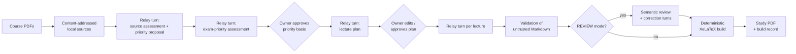

# Course Compiler

[](https://github.com/sabers13/course-compiler/actions/workflows/ci.yml)
[](LICENSE)

[](https://github.com/sabers13/course-compiler/tags)

**A local-first compiler that turns private course PDFs into exam-oriented lectures and a validated study PDF.**

An LLM writes the lecture content. Course Compiler keeps the sources, the workflow state, the owner approvals, the validation, and the PDF build on your own machine.

> **Core principle: the LLM writes; deterministic software validates and builds.**

> [!IMPORTANT]
> **v0.1.0-alpha.1 is a Local Developer Preview.** It is intended for local, single-user experimentation. It is **not** a hosted service, **not** multi-user, and **not** production-ready. Semantic generation currently runs through a browser-mediated ChatGPT relay only.

---

## Why Course Compiler?

Asking a chatbot to "summarize my course" produces text that is hard to trust, hard to resume, and hard to turn into a clean document. Course Compiler treats generation as one step inside a controlled pipeline:

| ChatGPT (via the relay) | Course Compiler (local) |
| --- | --- |
| Writes the source and exam-priority assessments, the lecture plan, one lecture per turn, and REVIEW feedback when requested | Stores exact source bytes and decides which evidence each turn may use |
| Receives only the evidence you explicitly attach | Holds workflow state, owner approvals, and revisions durably in SQLite |
| Returns Markdown and nothing else | Treats that Markdown as untrusted and validates it before rendering |
| Never approves plans or triggers builds | Renders LaTeX and compiles the PDF deterministically |

---

## How it works



1. **Sources.** Attached PDFs are stored as exact, immutable bytes under an opaque content-addressed reference. The original filename is a session convenience only.
2. **Relay turns.** For each semantic task the app shows the prompt and the exact current evidence to attach. You run it in a fresh ChatGPT conversation and paste the Markdown back.
3. **Owner approvals.** After the source assessment and exam-priority assessment turns, the priority basis requires your explicit approval. After the lecture-plan turn, the plan can be edited and must be approved too. Approvals are bound to a hash of the content you reviewed.
4. **Lectures.** Lectures are generated one per turn against the approved plan.
5. **Review (optional).** In REVIEW mode, a semantic review can request corrections, and the build stays disabled until a new review returns no further corrections.
6. **Build.** Accepted content is rendered to LaTeX, compiled with XeLaTeX, and stored with a durable build record.

---

## Key design decisions

### LLM output is untrusted input

Generated Markdown must fit a constrained formatting profile. Mathematics is checked against a static, versioned safe-math catalog: unknown commands are not executable, and installed TeX packages are never consulted at runtime to decide what is allowed.

### Explicit, bounded evidence transfer

The app holds no provider API key and makes no network calls to OpenAI or any other provider. Evidence leaves your machine only when you download the listed files and attach them to ChatGPT yourself.

### Durable, stale-safe workflow

Courses, jobs, approvals, and build history survive refreshes and restarts. Before a relay result is submitted, the app renews its lease and verifies the durable state has not moved since the relay opened. A stale submission is refused, not merged.

### Reproducible PDF builds

Builds use a fixed compilation profile, named font families, and a fixed `SOURCE_DATE_EPOCH`, so identical accepted content is reproducible within the documented toolchain profile. Compiled PDF bytes are memoized for reuse, with their identity recorded durably in the build record.

### Content-safe failure

Startup and HTTP diagnostics are stable codes such as `data_root_invalid` or `build_not_succeeded`. They never include source bytes, file paths, or stack traces.

---

## Requirements

- **Python 3.10+** as `python3`. The core runtime uses the Python standard library and a vanilla HTML/CSS/JS frontend; no third-party Python packages are needed to run the app.
- **To compile PDFs:** TeX Live with `latexmk`, `xelatex`, and `kpsewhich`; Poppler (`pdftoppm`, plus `pdfinfo` for the full test suite); fontconfig (`fc-match`) with `fonts-lmodern` and `fonts-noto-mono`.
- **Optional:** the MCP Python SDK in [`requirements-mcp.txt`](requirements-mcp.txt), only for the future hosted MCP seam and its integration tests.

Exact packages and reproduction steps are in [`docs/TOOLCHAIN.md`](docs/TOOLCHAIN.md).

---

## Installation

```bash
git clone https://github.com/sabers13/course-compiler.git
cd course-compiler
```

## Quick start

```bash
make app
# or: python3 -m course_compiler.app
```

Open `http://127.0.0.1:8787/`, then:

1. Click **+ New Course**, add a title and optional course guidance, and choose **fast** or **review**.
2. Click **Attach Sources** and select one or more PDFs.
3. Click **Start Generation**.
4. Click **Continue in ChatGPT**. For each turn, copy the prompt, attach only the listed evidence in a fresh ChatGPT conversation, and paste the Markdown response back. Complete the source-assessment and exam-priority-assessment turns as prompted.
5. Review and **Approve** the priority basis.
6. Continue in ChatGPT for the lecture plan; edit it if needed, then approve it.
7. Continue the relay one lecture at a time. In REVIEW mode, complete any review and correction turns.
8. Click **Build PDF**, then **Download PDF**.

After a page reload, the relay button reads **Resume in ChatGPT**. To exercise the local generation and build path without ChatGPT, **Run Synthetic Demo Generation** drives built-in fixture content through the backend and automatically advances its synthetic approval gates. The content is demo material, not ChatGPT output.

### Options

| Flag | Purpose |
| --- | --- |
| `--port N` | Port (default `8787`; `0` for an ephemeral port) |
| `--data-root PATH` | Data root (default `local-data/app`); must be inside `local-data/`, `local-artifacts/`, or `build/` |
| `--allow-non-loopback` | Development-only override; non-loopback binds are refused without it |

### If startup fails

Startup diagnostics are fixed, content-safe codes:

| Code | Meaning |
| --- | --- |
| `host_invalid` | The host value is malformed |
| `host_not_loopback` | A non-loopback bind was requested without `--allow-non-loopback` |
| `port_invalid` | The port is outside the allowed range |
| `data_root_invalid` | The data root is missing or outside an approved ignored root |
| `data_root_unavailable` | The data root could not be prepared, for example because of permissions |

### FAST vs REVIEW

- **FAST** accepts generated content as final once generation completes.
- **REVIEW** adds a Semantic Content Review between generation and build. Corrections require another relay turn and a new review verdict before **Build PDF** is enabled.

Semantic Content Review is separate from Document Checks, which run in both modes.

---

## Privacy

- Source bytes, generated content, workflow state, and build records live under the git-ignored `local-data/` root. Caches and artifacts may use the git-ignored `local-artifacts/` and `build/` roots. The tracked repository never contains course material.
- The app is loopback-only by default.
- **GPT mode is not fully offline.** The app does not automatically upload evidence to ChatGPT, but the evidence you download and attach yourself does leave your machine. The app keeps that transfer explicit and bounded.

---

## Current limitations

- v0.1 is not a production SaaS and not enterprise-ready. There is no hosted SaaS, multi-tenant, or hosted public HTTPS deployment.
- Single-user only: no multi-user isolation, public submission, or official publication step.
- ChatGPT relay only; BYOK (bring-your-own-key) providers are deferred to a future release.
- Unusual formula or Markdown formatting in generated output can still require repair.
- Public tests use invented synthetic PDFs only and never exercise private course material.

---

## Development

```bash
make test   # public test suite
make gate   # release validation gate
```

The gate checks required files, Python parsing, the module manifest in [`architecture/modules.yaml`](architecture/modules.yaml), tracked-path hygiene, ignored roots, and the public tests, then runs a synthetic XeLaTeX toolchain probe that is non-fatal when TeX is not installed.

Optional MCP and full-toolchain tests skip with the missing prerequisite named when their dependencies are unavailable; a present but broken dependency still fails. GitHub Actions runs `make gate` on pushes and pull requests to `main` with the MCP dependencies installed and without the TeX stack, so PDF toolchain tests are skipped there. Full PDF validation runs with `make gate` on a machine that satisfies [`docs/TOOLCHAIN.md`](docs/TOOLCHAIN.md).

### Repository layout

```text
course_compiler/         application package (domain, workflow, persistence, rendering, build)
course_compiler/app/     local HTTP server and static frontend
skills/course-compiler/  ChatGPT skill with versioned authoring and review prompts
architecture/            module manifest
ci/                      release validation gate
docs/                    architecture and toolchain documentation
tests/                   public test suite with synthetic fixtures
```

See [`docs/ARCHITECTURE.md`](docs/ARCHITECTURE.md) for the layered module design.

---

## License

MIT. See [LICENSE](LICENSE).
